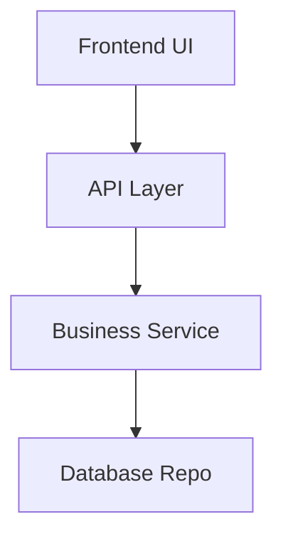

# 🏛️ Architecture & System Design Skill

This skill provides modular guidelines for choosing and implementing software architectures (such as Layered, Hexagonal, or Event-Driven) within an AI agent workflow.

---

## 🛠️ Design Principles

### 1. Separation of Concerns (SoC)
Ensure your app has distinct layers:
-   **View Layer** (React / HTML / CSS)
-   **Business Logic Layer** (Express / FastAPI / Services)
-   **Data Access Layer** (Prisma / Drizzle / Repository patterns)

### 2. Interface-First Development
Define your types and interfaces before writing implementations. This prevents drift.

---

## 📝 Architectural Styles

### 🥞 Layered Architecture (Standard)
Best for standard CRUD apps.
-   `src/components/`
-   `src/services/`
-   `src/models/`

### 🔄 Clean / Hexagonal (Advanced)
Best for apps with changing infrastructure (e.g., swapping databases).
-   `src/domain/` (Pure logic, no dependencies)
-   `src/application/` (Use cases)
-   `src/infrastructure/` (Express, DB, external APIs)

---

> [!TIP]
> Use **Mermaid diagrams** inside your design docs to explain relationships between services.

---

## 🎨 Rich Visual AI Diagrams (Nano Banana)

If you have access to external Image Generation APIs (like Vertex AI Imagen 3), elevate your architecture diagrams into **Visually Rich Mockups** or custom UI overrides.

### 🧬 Prompt Keyword Formula:
Always prepend these aesthetic keywords for consistency:
-   **Style**: Matte black stealth tech, sleek cyber-industrial.
-   **Color Workspace**: High-contrast neon yellow and glowing white.
-   **Lighting**: Cyberpunk cinematically top-lit.

### 🧪 Example Prompts:
> A high-tech system architecture overview on a matte black glass screen. Glowing neon yellow data lines show data flow between microservices. The UI feels premium, sleek, and cybernetic (Nano Banana aesthetic).

---

> [!TIP]
> Use these prompts to generate UI wireframes for **Login Pages** or **Dashboards** to give clients a wow factor during architecture review sessions!

